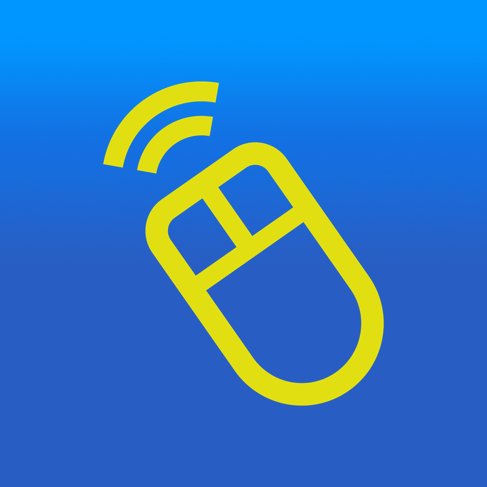
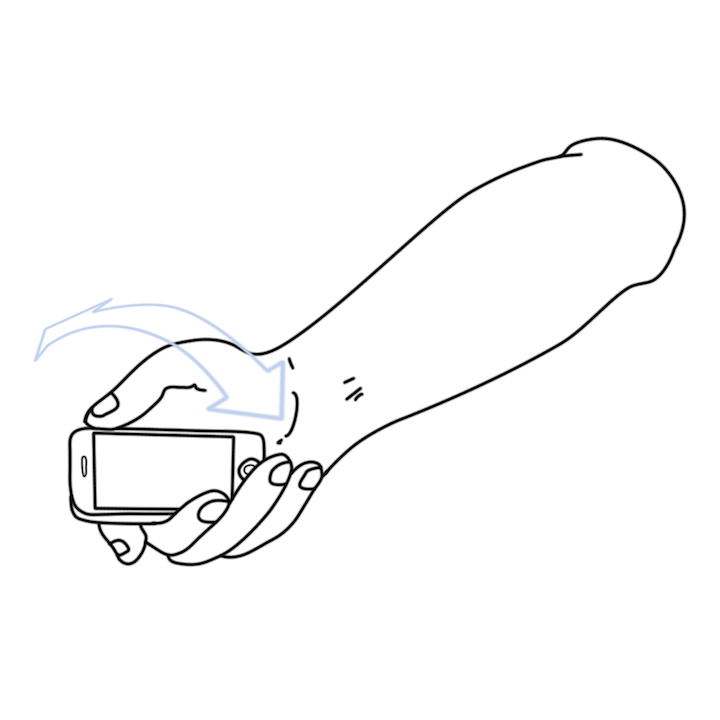

#  GyroMouse – Remote Wireless Mouse for iOS

***Old unmantained Swift 3.x app***

  |    |  
:-----------:|:-----------:|:-------------:
Move your iPhone to move the pointer onscreen! | Tilt the iPhone left or right to scroll! Easy peasy! | Shake that iPhone to recalibrate the pointer position on the screen

**Requires a MacOS X 10.9 or above**

Hi there! Are you one of those who have their computer plugged into their TVs? Are you tired of getting up from your comfy couch, just to raise the volume, type something in the keyboard or move the mouse? 

Worry no more! With GyroMouse you can:

* Move your mouse just by moving your iPhone up and down, left or right! The pointer onscreen will follow your hand! How cool is that?
* Free hoverboard included (*)
* Are you on a website and need to scroll the page? Just tilt the iPhone left or right to scroll the page! Just like magic!
* Type on the keyboard from your iPhone and see directly on the iPhone what you're writing! You don't have to force your sight to see it on the TV!
* Turn the volume up or down
* Are you so comfy you physically can't get up after the movie ended? Don't worry! You can shut your computer down with a tap! Extra lazy!

*GyroMouse requires a free companion app called GyroServer available at: http://gyromouse.altervista.org*

*\(\*\) Free overboard included only for time travellers from 1985*

App interface | Server selection
:-----------:|:-----------:
  |  
